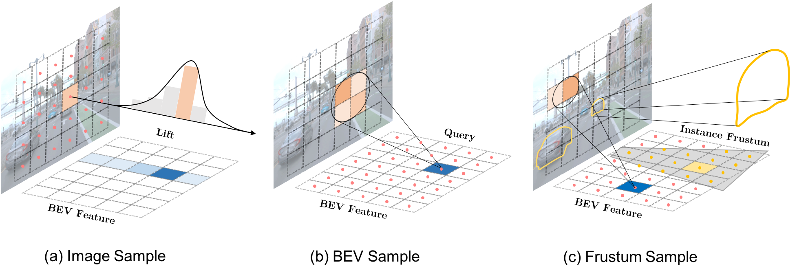

# <center>FrustumFormer<center>
> [CVPR 2023] [**FrustumFormer: Adaptive Instance-aware Resampling for Multi-view 3D Detection**](https://arxiv.org/pdf/2301.04467.pdf).
> Yuqi Wang, Yuntao Chen, Zhaoxiang Zhang

<div align="center">

</div>

# News
- **[2023/3/26]** We release the camera ready version([Paper in arXiv](https://arxiv.org/pdf/2301.04467.pdf))
- **[2023/2/28]** *FrustumFormer* was accepted by CVPR 2023.

# Catalog
- [x] Initialization

# Getting Started
- [Installation](docs/install.md) 

# Bibtex
If this work is helpful for your research, please consider citing the following BibTeX entry.

```
@article{wang2023frustumformer,
  title={FrustumFormer: Adaptive Instance-aware Resampling for Multi-view 3D Detection},
  author={Wang, Yuqi and Chen, Yuntao and Zhang, Zhaoxiang},
  journal={arXiv preprint arXiv:2301.04467},
  year={2023}
}
```

# Acknowledgement 
Many thanks to the following open-source projects:
* [mmdetection3d](https://github.com/open-mmlab/mmdetection3d)
* [BEVFormer](https://github.com/fundamentalvision/BEVFormer)